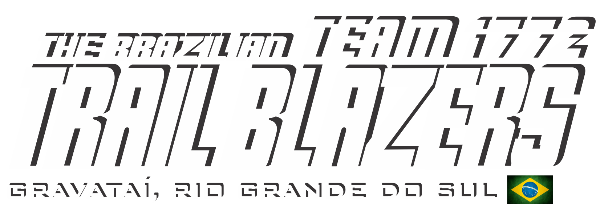

<h1 align="center">
    
    <p>Eco Blazer</p> 
</h1>

## 📖 About
**EcoBlazer** is a project that aims to help people quickly find trash cans, reducing pollution in cities. This project was made for Eco Latam.

## 🔨 Tools
- [React](https://react.dev/)
- [Firebase](https://firebase.google.com/)

## 💻 Setup
````bash
# Clone the project 
git clone https://github.com/Team1772/sustainability-project.git
````
````bash
# Enter directory  
cd sustainability-project
````
````bash
# Install dependencies and start project
npm install
npm start
````

## Sample
We use this [repository](https://github.com/googlemaps/js-samples) as a sample to make this project.


